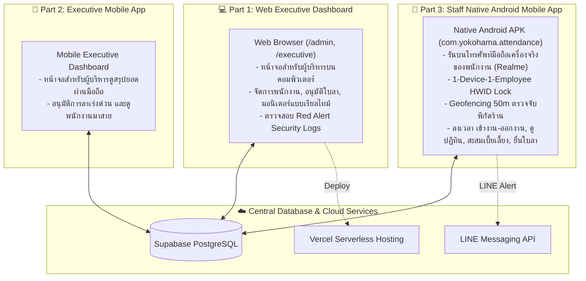

# 📋 PROJECT REQUIREMENTS & SYSTEM SPECIFICATIONS
> **ระบบลงเวลาทำงานและจัดการเบี้ยเลี้ยงอัจฉริยะ (สีแสงยางยนต์ - YOKOHAMA NAYA COSMIS)**  
> *เอกสารความต้องการของระบบ โครงสร้างสถาปัตยกรรม และตารางบันทึกการปรับปรุงความต้องการ (Living Requirements)*

---

## 🏗️ 1. โครงสร้างสถาปัตยกรรมระบบ 3 ส่วน (System Division)

ระบบถูกแบ่งออกเป็น 3 ส่วนหลักอย่างชัดเจนตามข้อกำหนด:

| ส่วนของระบบ | แพลตฟอร์ม / ช่องทาง | ผู้ใช้งาน | ฟังก์ชันหลัก |
| :--- | :--- | :--- | :--- |
| **Part 1: Web Executive Dashboard** | Web Browser (`https://check-empolye.vercel.app/admin`) | ผู้บริหาร / แอดมิน | จัดการบัญชีพนักงาน, อนุมัติใบลา, กราฟสถิติ, รายงานสรุปเบี้ยเลี้ยง, Red Alert ความปลอดภัย |
| **Part 2: Executive Mobile App** | Mobile App / Mobile Web | ผู้บริหาร | สรุปยอดลงเวลารายวัน, อนุมัติคำขอลาเร่งด่วนผ่านมือถือ |
| **Part 3: Staff Native Mobile App** | Native Android APK (`com.yokohama.attendance`) บนมือถือจริง | พนักงานร้าน | บันทึกเวลาเข้า-ออกงาน, ตรวจสอบพิกัด GPS ร้าน 50 ม., ปฏิทินเบี้ยเลี้ยงสะสม, ยื่นคำขอลา |

---

## 🎯 2. กฎเกณฑ์ทางธุรกิจและข้อกำหนดระบบ (Core Business Logic)

### 2.1 กฎการลงเวลาและการคำนวณเบี้ยเลี้ยง (Shift & Allowance Rules)
- **พิกัดร้าน (Store Geofence)**: `Lat: 15.110412, Lng: 104.358434` (สีแสงยางยนต์ YOKOHAMA NAYA COSMIS)
- **รัศมีที่อนุญาต**: ภายใน **50 เมตร** (คำนวณผ่าน Haversine Formula บนพิกัด GPS ความแม่นยำสูง)
- **เวลากะทำงานปกติ**: **07:40 น.**
- **เวลาอนุโลมสูงสุด (Grace Period)**: **08:00 น.**
- **การคิดเบี้ยขยัน (Allowance)**:
  - มาถึง $\le$ 08:00 น. $\rightarrow$ สถานะ **ตรงเวลา (PRESENT)** รับเบี้ยขยัน **+50 บาท/วัน**
  - มาถึง $>$ 08:00 น. $\rightarrow$ สถานะ **มาสาย (LATE)** รับเบี้ยขยัน **0 บาท** และส่งแจ้งเตือนเข้า LINE กลุ่มผู้บริหาร

### 2.2 ระบบความปลอดภัยและการป้องกันการทุจริต (Anti-Fraud & Security)
- **1 คน 1 เครื่อง (1-Device-1-Employee HWID Lock)**:
  - เมื่อพนักงานเข้าสู่ระบบบนโทรศัพท์มือถือครั้งแรก ระบบจะดึงรหัส Hardware Fingerprint (HWID) ผูกติดกับบัญชีพนักงาน
  - หากมีการนำเครื่องเดิมไปล็อกอินให้พนักงานคนอื่น $\rightarrow$ ระบบจะตรวจพบ `CRITICAL HWID OVERLAP` และแจ้งเตือน Red Alert บน Dashboard ผู้บริหารทันที

### 2.3 การยื่นและอนุมัติใบลา (Leave Management Flow)
- พนักงานสามารถยื่นคำขอลาได้ 4 ประเภท: **ลาป่วย 🩺, ลากิจ 💼, ลาพักร้อน 🏖️, อื่นๆ 📝**
- ผู้บริหารสามารถตรวจสอบและกด "อนุมัติ" หรือ "ปฏิเสธ" ผ่าน Dashboard
- สถานะใบลาจะสะท้อนเข้าสู่ปฏิทินของพนักงานแบบเรียลไทม์

---

## 📊 3. ตารางสถานะฟีเจอร์และความต้องการ (Requirements & Task Backlog)

| รหัส Ticket | หมวดหมู่ | รายละเอียดความต้องการ | สถานะ | เครื่องมือ / แพลตฟอร์ม |
| :--- | :--- | :--- | :---: | :--- |
| **REQ-001** | Architecture | แยก 3 โปรเจกต์: Web Dashboard, Executive Mobile, Staff Native App | ✅ เสร็จสิ้น | Vercel / Capacitor / Next.js |
| **REQ-002** | Web Executive | หน้าจอผู้บริหารบนคอมพิวเตอร์ ตรวจสอบพนักงาน, ประวัติ, ข้อมูลสถิติ | ✅ เสร็จสิ้น | Web / Vercel (`/admin`) |
| **REQ-003** | Mobile Staff | บิวด์แอป Native Android ติดตั้งบนโทรศัพท์จริงของพนักงาน (Realme RMX3491) | ✅ เสร็จสิ้น | Capacitor / Gradle / ADB |
| **REQ-004** | Security | ระบบ HWID Device Fingerprint ป้องกันการลงเวลาแทนกัน | ✅ เสร็จสิ้น | Native HWID / Supabase |
| **REQ-005** | Geofence | ระบบตรวจสอบพิกัด GPS ร้านรัศมี 50 เมตร ป้องกันการลงเวลานอกสถานที่ | ✅ เสร็จสิ้น | Geolocation / Haversine |
| **REQ-006** | Attendance | ระบบคำนวณเบี้ยขยัน 50฿ และแยกสถานะ ตรงเวลา/สาย/ลา | ✅ เสร็จสิ้น | PostgreSQL / Live Supabase |
| **REQ-007** | Leave System | ระบบยื่นคำขอลาบนมือถือพนักงาน และปุ่มอนุมัติบนหน้าผู้บริหาร | ✅ เสร็จสิ้น | Mobile UI / Admin Flow |
| **REQ-008** | Living Spec | จัดทำเอกสาร `.MD` บันทึกความต้องการและคอยอัปเดตต่อเนื่อง | 🔄 กำลังดำเนินการ | `PROJECT_REQUIREMENTS.md` |

---

## 🛠️ 4. สภาพแวดล้อมและเครื่องมือในการพัฒนา (Environment & Tooling)

- **โทรศัพท์ทดสอบจริง**: Realme RMX3491 (Device ID: `f4da450d`)
- **Android SDK Path**: `C:\Users\tlelo\.gemini\antigravity\tools\android-sdk`
- **Java JDK Path**: `C:\Users\tlelo\.gemini\antigravity\tools\jdk-21`
- **ADB Command Tool**: `C:\Users\tlelo\.gemini\antigravity\tools\platform-tools\adb.exe`
- **Web Production Host**: `https://check-empolye.vercel.app`
- **Supabase Live Database**: `https://bcliaorfqyxgiisocmmq.supabase.co`

---

## 📝 5. บันทึกการเปลี่ยนแปลงและความต้องการเพิ่มเติม (Changelog & Future Additions)

*พื้นที่สำหรับบันทึกและปรับปรุงความต้องการใหม่ๆ ที่ผู้ใช้งานแจ้งเข้ามาอย่างต่อเนื่อง:*

### 📌 [2026-09-27] - Initial Living Requirements Release
- ✅ รวบรวมสถาปัตยกรรมระบบทั้ง 3 ส่วนลงในเอกสาร
- ✅ บันทึกรายละเอียดการเชื่อมต่อ Native Android บนอุปกรณ์จริง
- ✅ สรุปกฎทางธุรกิจ Geofencing, Shift, เบี้ยเลี้ยง 50 บาท และ HWID
- 🔄 พร้อมรับและปรับปรุงความต้องการเพิ่มเติมตามคำสั่งของผู้ใช้งาน
