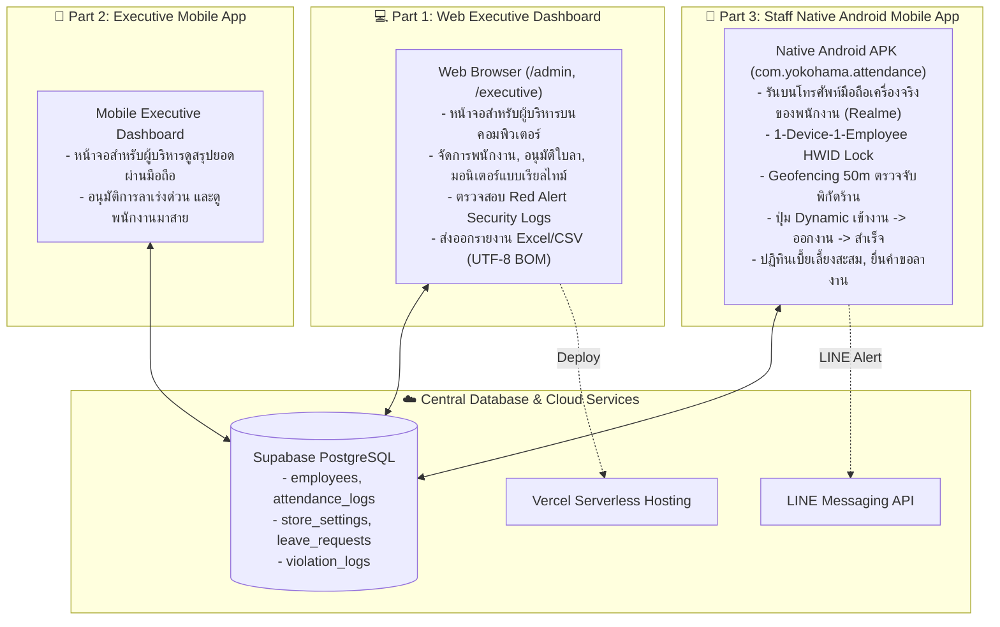

# 📋 PROJECT REQUIREMENTS & SYSTEM SPECIFICATIONS
> **ระบบลงเวลาทำงานและจัดการเบี้ยเลี้ยงอัจฉริยะ (สีแสงยางยนต์ - YOKOHAMA NAYA COSMIS)**  
> *เอกสารความต้องการของระบบ โครงสร้างสถาปัตยกรรม และตารางบันทึกการปรับปรุงความต้องการ (Living Requirements)*

---

## 🏗️ 1. โครงสร้างสถาปัตยกรรมระบบ 3 ส่วน (System Division)

ระบบถูกแบ่งออกเป็น 3 ส่วนหลักอย่างชัดเจนตามข้อกำหนด:

| ส่วนของระบบ | แพลตฟอร์ม / ช่องทาง | ผู้ใช้งาน | ฟังก์ชันหลัก |
| :--- | :--- | :--- | :--- |
| **Part 1: Web Executive Dashboard** | Web Browser (`https://check-empolye.vercel.app/admin`) | ผู้บริหาร / แอดมิน | จัดการบัญชีพนักงาน, อนุมัติใบลา, กราฟสถิติ 3D, ส่งออกรายงาน Excel/CSV, Red Alert ความปลอดภัย |
| **Part 2: Executive Mobile App** | Mobile App / Mobile Web | ผู้บริหาร | สรุปยอดลงเวลารายวัน, อนุมัติคำขอลาเร่งด่วนผ่านมือถือ |
| **Part 3: Staff Native Mobile App** | Native Android APK (`com.yokohama.attendance`) บนมือถือจริง | พนักงานร้าน | บันทึกเวลาเข้างาน-ออกงาน, ตรวจสอบพิกัด GPS ร้าน 50 ม., ปฏิทินเบี้ยเลี้ยงสะสม, ยื่นคำขอลา |

---

## 🎯 2. กฎเกณฑ์ทางธุรกิจและข้อกำหนดระบบ (Core Business Logic)

### 2.1 กฎการลงเวลาและการคำนวณเบี้ยเลี้ยง (Shift & Allowance Rules)
- **พิกัดร้าน (Store Geofence)**: `Lat: 15.110412, Lng: 104.358434` (สีแสงยางยนต์ YOKOHAMA NAYA COSMIS)
- **รัศมีที่อนุญาต**: ภายใน **50 เมตร** (คำนวณผ่าน Haversine Formula บนพิกัด GPS ความแม่นยำสูง)
- **เวลากะทำงานปกติ**: **07:40 น.**
- **เวลาอนุโลมสูงสุด (Grace Period)**: **08:00 น.**
- **การคิดเบี้ยขยัน (Allowance)**:
  - มาถึง $\le$ 08:00 น. $\rightarrow$ สถานะ **ตรงเวลา (PRESENT)** รับเบี้ยขยัน **+50 บาท/วัน**
  - มาถึง $>$ 08:00 น. $\rightarrow$ สถานะ **มาสาย (LATE)** รับเบี้ยขยัน **0 บาท** และส่งแจ้งเตือนเข้า LINE กลุ่มผู้บริหาร
- **การลงเวลาออกงาน (Check-Out Flow)**:
  - เมื่อหมดเวลากะ พนักงานสามารถกดปุ่ม "ออกงาน" ผ่านแอปมือถือ
  - บันทึกเวลาออกงาน (`check_out_time`) และคำนวณระยะเวลาทำงานสุทธิต่อวัน
- **การป้องกันการลงเวลาซ้ำ (Daily Duplicate Prevention)**:
  - บล็อกที่ระดับ Backend API ป้องกันไม่ให้เกิด Log เข้างานซ้ำซ้อนในวันเดียวกัน

### 2.2 ระบบความปลอดภัยและการป้องกันการทุจริต (Anti-Fraud & Security)
- **1 คน 1 เครื่อง (1-Device-1-Employee HWID Lock)**:
  - เมื่อพนักงานเข้าสู่ระบบบนโทรศัพท์มือถือครั้งแรก ระบบจะดึงรหัส Hardware Fingerprint (HWID) ผูกติดกับบัญชีพนักงาน
  - หากมีการนำเครื่องเดิมไปล็อกอินให้พนักงานคนอื่น $\rightarrow$ ระบบจะตรวจพบ `CRITICAL HWID OVERLAP` และแจ้งเตือน Red Alert บน Dashboard ผู้บริหารทันที

### 2.3 การยื่นและอนุมัติใบลา (Leave Management Flow)
- พนักงานสามารถยื่นคำขอลาได้ 4 ประเภท: **ลาป่วย 🩺, ลากิจ 💼, ลาพักร้อน 🏖️, อื่นๆ 📝**
- ผู้บริหารสามารถตรวจสอบและกด "อนุมัติ" หรือ "ปฏิเสธ" ผ่าน Dashboard
- สถานะใบลาจะสะท้อนเข้าสู่ปฏิทินของพนักงานแบบเรียลไทม์

---

## 📊 3. ตารางสถานะฟีเจอร์และความต้องการ (Requirements & Task Backlog)

### 3.1 ฟีเจอร์ที่พัฒนาแล้วเสร็จ (Completed Features)

| รหัส Ticket | หมวดหมู่ | รายละเอียดความต้องการ | สถานะ | เครื่องมือ / แพลตฟอร์ม |
| :--- | :--- | :--- | :---: | :--- |
| **REQ-001** | Architecture | แยก 3 โปรเจกต์: Web Dashboard, Executive Mobile, Staff Native App | ✅ เสร็จสิ้น | Vercel / Capacitor / Next.js |
| **REQ-002** | Web Executive | หน้าจอผู้บริหารบนคอมพิวเตอร์ ตรวจสอบพนักงาน, ประวัติ, ข้อมูลสถิติ | ✅ เสร็จสิ้น | Web / Vercel (`/admin`) |
| **REQ-003** | Mobile Staff | บิวด์แอป Native Android ติดตั้งบนโทรศัพท์จริงของพนักงาน (Realme RMX3491) | ✅ เสร็จสิ้น | Capacitor / Gradle / ADB |
| **REQ-004** | Security | ระบบ HWID Device Fingerprint ป้องกันการลงเวลาแทนกัน | ✅ เสร็จสิ้น | Native HWID / Supabase |
| **REQ-005** | Geofence | ระบบตรวจสอบพิกัด GPS ร้านรัศมี 50 เมตร ป้องกันการลงเวลานอกสถานที่ | ✅ เสร็จสิ้น | Geolocation / Haversine |
| **REQ-006** | Attendance | ระบบคำนวณเบี้ยขยัน 50฿ และแยกสถานะ ตรงเวลา/สาย/ลา | ✅ เสร็จสิ้น | PostgreSQL / Live Supabase |
| **REQ-007** | Leave System | ระบบยื่นคำขอลาบนมือถือพนักงาน และปุ่มอนุมัติบนหน้าผู้บริหาร | ✅ เสร็จสิ้น | Mobile UI / Admin Flow |
| **REQ-008** | Living Spec | จัดทำเอกสาร `.MD` บันทึกความต้องการและคอยอัปเดตต่อเนื่อง | ✅ เสร็จสิ้น | `PROJECT_REQUIREMENTS.md` |
| **REQ-009** | Realtime Flow | เชื่อมต่อข้อมูลมือถือ ↔ เว็บ ↔ Supabase แบบ Real-time ทันที (<100ms) และเรียงลำดับการลงเวลาล่าสุดไว้บนสุด | ✅ เสร็จสิ้น | Supabase Realtime / WebSocket |
| **REQ-010** | Attendance | ระบบลงเวลา "ออกงาน" (Check-Out Flow) บันทึกเวลาเลิกงานและระยะเวลาทำงาน | ✅ เสร็จสิ้น | API `/api/check-out` / Mobile UI |
| **REQ-011** | Reporting | ปุ่มส่งออกรายงาน Excel / CSV (Export Report UTF-8 with BOM สำหรับภาษาไทย) | ✅ เสร็จสิ้น | Admin Web Dashboard (`/admin`) |
| **REQ-012** | Attendance | ระบบป้องกันการกดเช็คอินซ้ำในวันเดียวกัน (Daily Check-in Duplicate Prevention) | ✅ เสร็จสิ้น | API `/api/check-in` Backend Guard |
| **REQ-018** | Geofence | ระบบพิกัดดาวเทียมฮาร์ดแวร์ความแม่นยำสูง และซิงค์จุดมาร์คร้านจากเว็บสู่มือถือแบบเรียลไทม์ (<100ms) | ✅ เสร็จสิ้น | Capacitor Geolocation / Supabase Realtime |

---

### 3.2 คลังความต้องการในอนาคต (Future Feature Backlog)

| รหัส Ticket | หมวดหมู่ | รายละเอียดความต้องการ | ระดับความสำคัญ | แพลตฟอร์ม |
| :--- | :--- | :--- | :---: | :--- |
| **REQ-013** | Notifications | แจ้งเตือน LINE Notify เมื่อมีพนักงานยื่นใบลาใหม่ และแจ้งเตือนผลการอนุมัติ/ปฏิเสธ | ปานกลาง | LINE Messaging API |
| **REQ-014** | Security & Profile | ระบบให้พนักงานเปลี่ยนรหัสผ่าน PIN 4 หลัก ด้วยตนเองผ่านแอปมือถือ | ปานกลาง | Mobile Staff App |
| **REQ-015** | Notifications | Push Notification บนโทรศัพท์ แจ้งเตือนพนักงานก่อน 07:40 น. ไม่ให้ลืมเข้างาน | แนะนำ | Native Push / Capacitor |
| **REQ-016** | Reporting | ตัวเลือกเลือกช่วงวันที่รายงานแบบกำหนดเองอิสระ (Custom Date Range Filter) | แนะนำ | Web Admin Dashboard |
| **REQ-017** | Reliability | แถบแสดงสถานะเตือนเมื่อเน็ตมือถือหลุดชั่วขณะ (Offline Indicator Banner) | แนะนำ | Mobile Staff App |

---

## 🛠️ 4. สภาพแวดล้อมและเครื่องมือในการพัฒนา (Environment & Tooling)

- **โทรศัพท์ทดสอบจริง**: Realme RMX3491 (Device ID: `f4da450d`)
- **Android SDK Path**: `C:\Users\tlelo\.gemini\antigravity\tools\android-sdk`
- **Java JDK Path**: `C:\Users\tlelo\.gemini\antigravity\tools\jdk-21`
- **ADB Command Tool**: `C:\Users\tlelo\.gemini\antigravity\tools\platform-tools\adb.exe`
- **Web Production Host**: `https://check-empolye.vercel.app`
- **Supabase Live Database**: `https://bcliaorfqyxgiisocmmq.supabase.co`

---

## 📝 5. บันทึกการเปลี่ยนแปลงและความต้องการเพิ่มเติม (Changelog)

### 📌 [2026-09-27] - High-Precision Hardware Satellite GPS & Live Geofence Sync (Version 2.3)
- ✅ **สร้างโมดูลระบบพิกัดฮาร์ดแวร์ดาวเทียม (`src/lib/location.ts`)**: เชื่อมต่อชิป GPS ของเครื่องผ่าน `@capacitor/geolocation` พร้อมเปิด `enableHighAccuracy: true`
- ✅ **ยกเลิกพิกัดจำลองในแอปมือถือ (`src/app/employee/page.tsx`)**: ใช้พิกัดจริง 100% จากตัวเครื่องเพื่อวัดระยะห่างที่ถูกต้อง
- ✅ **ระบบซิงค์จุดมาร์คร้านค้าแบบเรียลไทม์ (<100ms)**: เมื่อผู้บริหารปรับเปลี่ยนหรือลากหมุดบนแผนที่หน้าเว็บ (`/admin`) ข้อมูลจะส่งตรงถึงมือถือพนักงานทันที และคำนวณระยะห่างใหม่ในเสี้ยววินาที
- ✅ **ดึงพิกัดสดทันทีที่กดปุ่มเข้างาน/ออกงาน**: ตรวจสอบตำแหน่ง ณ วินาทีที่กด เพื่อป้องกันพิกัดค้างหรือคลาดเคลื่อน

### 📌 [2026-09-27] - Check-Out Flow, CSV Export & Duplicate Prevention (Version 2.2)
- ✅ **เพิ่มคอลัมน์ `check_out_time`** ในฐานข้อมูล Supabase PostgreSQL ตาราง `attendance_logs`
- ✅ **สร้าง API Endpoint `/api/check-out`** รองรับการลงเวลาออกงาน ตรวจสอบ Geofence และคำนวณระยะเวลาทำงาน
- ✅ **ปรับปรุงปุ่ม Dynamic Button บนมือถือ** สลับสถานะระหว่าง "เข้างาน" $\rightarrow$ "ออกงาน" $\rightarrow$ "เสร็จสิ้น" พร้อมการ์ดสรุปเวลาออกงาน
- ✅ **เพิ่มระบบบล็อกการกดเช็คอินซ้ำในวันเดียวกัน (Daily Duplicate Prevention)** ใน `/api/check-in`
- ✅ **เพิ่มปุ่ม "📥 ส่งออก Excel / CSV"** บนหน้าเว็บผู้บริหาร รองรับภาษาไทยสมบูรณ์แบบ (`UTF-8 with BOM`)
- ✅ **บันทึก Backlog Ticket REQ-013 ถึง REQ-017** เข้าสู่คลังความต้องการของระบบ

### 📌 [2026-09-27] - Initial Living Requirements Release (Version 2.0)
- ✅ รวบรวมสถาปัตยกรรมระบบทั้ง 3 ส่วนลงในเอกสาร
- ✅ บันทึกรายละเอียดการเชื่อมต่อ Native Android บนอุปกรณ์จริง
- ✅ สรุปกฎทางธุรกิจ Geofencing, Shift, เบี้ยเลี้ยง 50 บาท และ HWID
