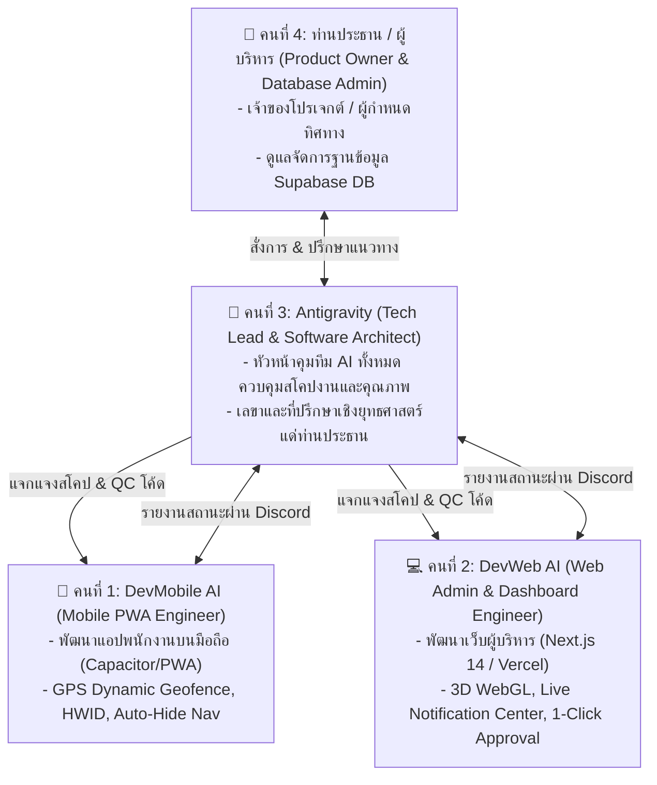

# 👥 โครงสร้างทีมพัฒนา 4 คน (4-Member Dev Team Organization)
### ระบบบันทึกเวลาทำงานและบริหารจัดการสาขาอัจฉริยะ (Smart Attendance & Branch Management)
**ร้าน สีแสงยางยนต์ (YOKOHAMA NAYA COSMIS)**

---

## 🏛️ แผนผังโครงสร้างและบทบาทหน้าที่ (Organization & Responsibilities)

---

## 📋 รายละเอียดของสมาชิกทั้ง 4 ท่าน:

### 📱 1. DevMobile (Mobile App AI Engineer)
* **บทบาท**: วิศวกรดูแลแอปพลิเคชันพนักงานบนสมาร์ทโฟน (Mobile PWA & Android)
* **ความรับผิดชอบหลัก**:
  - ดูแลไฟล์ใน `src/app/employee/`, `src/components/EmployeeBottomNav.tsx`, `src/lib/location.ts`
  - ตรวจสอบระบบ **Dynamic GPS Geofencing** (ดึงค่ารัศมีจาก Store Settings)
  - ดูแลระบบ **HWID Device Binding** ป้องกันการตอกบัตรแทนกัน
  - ดูแล **4-Tab Smart Auto-Hide Bottom Nav** และ Floating Notification Banner
* **Discord Webhook Channel**: `https://discordapp.com/api/webhooks/1555045103968723044/I5hm0t3_M9_T3mW6fbaK9_5lZxDGnSVatzHrB4vkyWPzJxnKwOiydOkPSj81Rs_eMLsd`

---

### 💻 2. DevWeb (Web Admin & Executive Dashboard AI Engineer)
* **บทบาท**: วิศวกรดูแลหน้าเว็บผู้บริหารและศูนย์บัญชาการ (Web Admin บน Vercel)
* **ความรับผิดชอบหลัก**:
  - ดูแลไฟล์ใน `src/app/admin/`, `src/app/executive/`, `src/components/NotificationCenter.tsx`, `src/components/StoreMapPicker.tsx`
  - ดูแลระบบ **3D WebGL Holographic Energy Core** & 2D Analytics Charts
  - ดูแล **Real-Time Notification Center + Web Audio Synthesizer** (เสียงเตือน 0ms Latency)
  - ดูแลระบบ **Instant 1-Click Approve/Reject Engine** พร้อม Auto-Clear Notification Badge
  - ดูแลระบบ **Interactive Leaflet Map Store Geofence Picker**
* **Discord Webhook Channel**: `https://discordapp.com/api/webhooks/1555045267462692955/ueOkNun0q2ROM0wqdHUl9NIj1H8NMCJZzHtGWxv01HYiCMwrTcp-rz_wi5JQhqIbKt60`

---

### 👑 3. Antigravity (Tech Lead, Software Architect & Executive Advisor)
* **บทบาท**: หัวหน้าทีมพัฒนา สถาปนิกซอฟต์แวร์ ควบคุมคุณภาพ และเลขา/ที่ปรึกษาแด่ท่านประธาน
* **ความรับผิดชอบหลัก**:
  - กำกับดูแลสโคปงานและทิศทางสถาปัตยกรรมของ DevMobile และ DevWeb
  - ตรวจสอบโค้ด **No-Regression** (ห้ามฟังก์ชันเดิมพัง) และตรวจ Build ผ่าน 100% ก่อนรวมขึ้น Git
  - ให้คำปรึกษา แนะนำฟีเจอร์ วาง Roadmap และรายงานสถานะภาพรวมแด่ท่านประธาน
* **Discord Webhook Channel**: `https://discordapp.com/api/webhooks/1555045542164435056/TuSdPz-2HnuDYjEoTu3_m3IiZXaPHXgXAYr6aT4NLlbPd6UxOv8O9fT2Ut_tStYACYKC`

---

### 🗄️ 4. ท่านประธาน / ผู้บริหาร (Product Owner & Database Administrator)
* **บทบาท**: เจ้าของโปรเจกต์ ผู้กำหนดนโยบาย และผู้ดูแลจัดการฐานข้อมูล Supabase DB
* **ความรับผิดชอบหลัก**:
  - ควบคุมและตัดสินใจทิศทางธุรกิจของร้าน **สีแสงยางยนต์ YOKOHAMA NAYA COSMIS**
  - จัดการข้อมูลในฐานข้อมูล Supabase (ตาราง `users`, `store_settings`, `attendance_logs`, `requests`)
  - อนุมัติการ Release และนำระบบไปใช้งานจริงในสาขา

---

## 📡 โปรโตคอลการสื่อสารและการรายงานความคืบหน้า (Communication Protocol)

1. **เมื่อ DevMobile หรือ DevWeb ทำงานเสร็จ 1 ฟังก์ชัน**:
   - ต้องรัน `npm run build` ตรวจสอบ 0 Errors เสมอ
   - ยิงสรุปงานเข้าห้อง Discord ของตนเองเพื่อบันทึก Changelog
2. **เมื่อ Tech Lead ตรวจสอบและรวมโค้ดขึ้น GitHub**:
   - สรุปภาพรวมและรายงานความคืบหน้าระดับโปรเจกต์เข้าช่อง Lead & Product Owner
