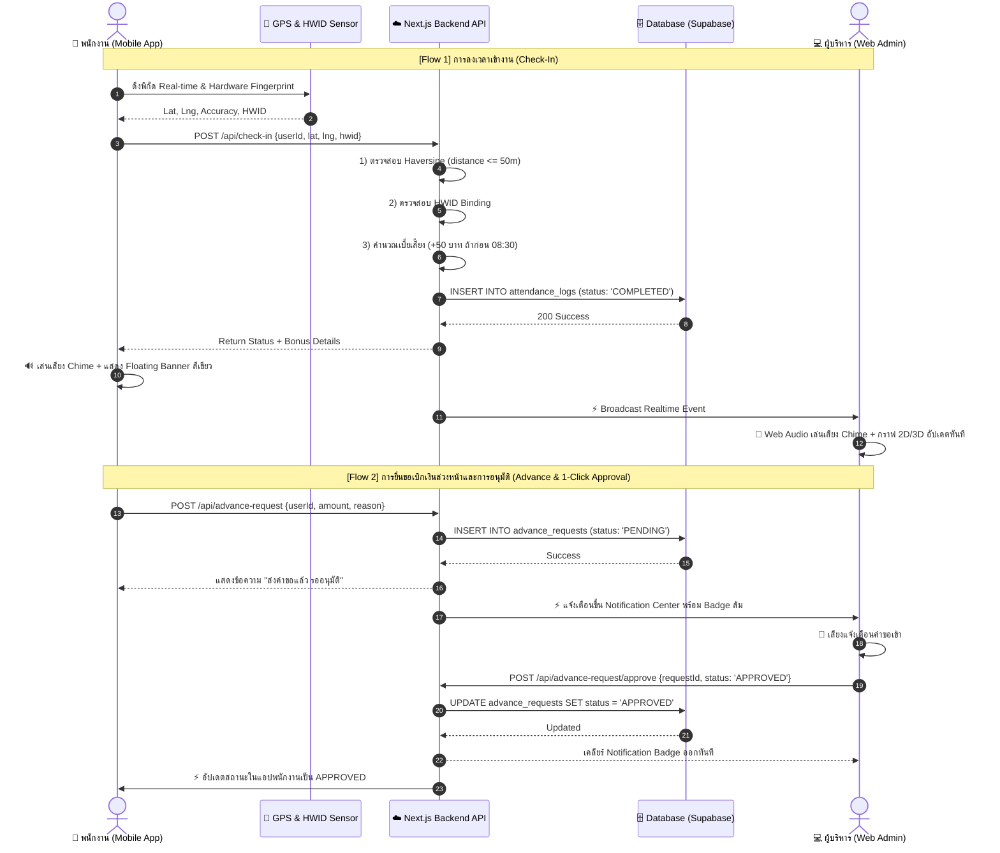
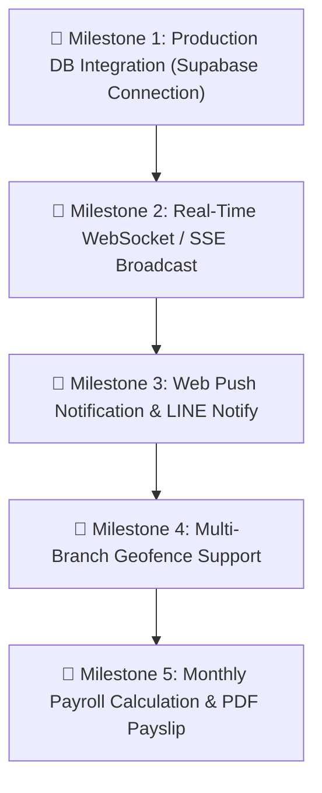

# 🧠 Master Handover & Task Scope for Senior AI Developer
### ระบบบันทึกเวลาทำงานและจัดการสาขาอัจฉริยะ (Smart Attendance & Branch Management System)
**ลูกค้า / ธุรกิจ: ร้านสีแสงยางยนต์ (YOKOHAMA NAYA COSMIS)**

---

## 🎯 1. Mission & Persona Briefing (เป้าหมายและบทบาทของ AI)

> **สำหรับ AI Developer ที่เข้ามารับช่วงต่อ:**
> คุณกำลังรับหน้าที่เป็น **Senior Full-Stack Developer & Software Architect** สำหรับโปรเจกต์ระบบลงเวลาและบริหารจัดการสาขาของร้าน **"สีแสงยางยนต์ YOKOHAMA NAYA COSMIS"**  
> งานหลักของคุณคือ: ต่อยอด พัฒนาฟีเจอร์ขั้นสูง เชื่อมต่อฐานข้อมูลจริง และดูแลรักษาเสถียรภาพของระบบโดย **ห้ามทำให้ฟีเจอร์เดิมที่ทำงานสมบูรณ์แล้วพัง (No Regression)**

---

## 🏗️ 2. Tech Stack & Architecture Overview

| หมวดหมู่ | เทคโนโลยีที่เลือกใช้ | รายละเอียด / หน้าที่ |
| :--- | :--- | :--- |
| **Frontend Framework** | **Next.js 14 (App Router)** | TypeScript, React 18, Server/Client Components |
| **Styling & UI** | **Tailwind CSS + Lucide Icons** | Dark Slate Glassmorphism Theme (ธีมร้านยาง Yokohama) |
| **Mobile PWA** | **PWA Service Worker + Manifest** | รองรับการติดตั้งลง Homescreen, Push API, Auto-Hide Nav |
| **3D & Visuals** | **Three.js / WebGL + Recharts** | แอนิเมชัน 3D Energy Core & กราฟสถิติ 2D Live Attendance |
| **Map & GIS** | **Leaflet GIS + OpenStreetMap** | Interactive Geofence Map Picker แสดงรัศมีวงกลม 50m |
| **Audio Engine** | **Web Audio API Synthesizer** | สังเคราะห์เสียง Chime ระดับ Sub-millisecond (ไม่ต้องโหลดไฟล์ .mp3) |
| **State & Storage** | **`db-store.ts` (IndexedDB / LocalStore) -> Supabase PostgreSQL** | Schema รองรับ PostgreSQL พร้อมใช้งาน |

---

## 📁 3. Codebase Directory Map

```text
attendance-pwa/
├── public/
│   ├── manifest.json              # PWA Manifest สำหรับติดตั้งลงมือถือ
│   ├── sw.js                      # Service Worker Cache & Offline
│   └── icons/                     # ไอคอนแอปพลิเคชัน
├── supabase/
│   └── schema.sql                 # โครงสร้างตาราง PostgreSQL (Users, Logs, Leaves, Config)
├── src/
│   ├── app/
│   │   ├── layout.tsx             # Root layout พร้อม metadata และ PWA setup
│   │   ├── page.tsx               # Entry Portal เลือกระหว่าง Employee App / Admin Dashboard
│   │   ├── admin/page.tsx         # Web Admin Dashboard (89KB - ศูนย์ควบคุมระบบ)
│   │   ├── executive/page.tsx     # Web Executive Analytics Dashboard (67KB - วิเคราะห์สถิติ 3D)
│   │   ├── employee/
│   │   │   ├── page.tsx           # หน้าหลักพนักงาน (58KB - GPS Check-in, Live Clock)
│   │   │   ├── advance/page.tsx   # หน้ายื่นขอเบิกเงินล่วงหน้า (Salary Advance)
│   │   │   ├── leave/page.tsx     # หน้ายื่นขอลางาน (Leave Portal)
│   │   │   ├── login/page.tsx     # หน้ายืนยันตัวตนพนักงาน (HWID + PIN)
│   │   │   └── stats/page.tsx     # หน้าสรุปสถิติการทำงานและประวัติเงินได้
│   │   └── api/                   # Next.js API Route Handlers
│   │       ├── check-in/          # API ลงเวลาเข้างาน + คำนวณเบี้ยเลี้ยง + ตรวจ Haversine 50m
│   │       ├── check-out/         # API ลงเวลาออกงาน + สรุปชั่วโมงทำงาน
│   │       ├── advance-request/   # API ยื่น/อนุมัติคำขอเบิกเงินล่วงหน้า
│   │       ├── leave/             # API ยื่น/อนุมัติคำขอลา
│   │       ├── admin/             # API จัดการผู้ใช้และพิกัดร้าน
│   │       └── auth/              # API ยืนยันตัวตนและตรวจจับ HWID Overlap
│   ├── components/
│   │   ├── EmployeeBottomNav.tsx  # 4-Tab Smart Auto-Hide Bottom Navigation
│   │   ├── NotificationCenter.tsx # Live Notification Drawer + 1-Click Clear
│   │   ├── SalaryAdvanceManager.tsx # ระบบจัดการและอนุมัติเงินเบิกล่วงหน้า
│   │   ├── SecurityLogsViewer.tsx # หน้าจอตรวจจับความผิดปกติ HWID & Mock GPS
│   │   ├── StoreMapPicker.tsx     # Leaflet Map เลือกพิกัดและรัศมี 50m
│   │   ├── ThreeBarChart3D.tsx    # กราฟแท่ง 3D WebGL
│   │   └── ThreeDonut3D.tsx       # กราฟโดนัท 3D WebGL
│   └── lib/
│       ├── db-store.ts            # Client-side Mock Engine & Reactive State Store
│       ├── geofence.ts            # สูตร Haversine Formula คำนวณระยะทางแม่นยำ
│       ├── hwid.ts                # Hardware Fingerprinting (Canvas, WebGL, Screen, UserAgent)
│       ├── web-notifications.ts   # Web Audio Synthesizer สำหรับฝั่งเว็บแอดมิน
│       ├── mobile-notifications.ts# In-App Floating Notification Banner สำหรับมือถือ
│       ├── location.ts            # Geolocation Watcher & Error Handler
│       ├── security-explainer.ts  # Threat Level Analysis & Anti-Fraud Explanation
│       └── types.ts               # Master TypeScript Type Definitions
```

---

## 🔍 4. System Review: ฟีเจอร์ที่พัฒนาเสร็จแล้ว 100%

### 📱 4.1 ฝั่งแอปพนักงาน (Mobile Employee PWA):
1. **📍 Hardware GPS Geofencing (50m Radius):**
   - คำนวณพิกัดดาวเทียมด้วยสูตร Haversine เทียบกับพิกัดร้าน (Default: `13.7563, 100.5018`)
   - อยู่นอกระยะ 50 เมตร ปุ่มลงเวลาจะถูกล็อก พร้อมแสดงระยะห่างจริงแบบเรียลไทม์
2. **⏱️ One-Tap Check-In / Check-Out & Live Clock:**
   - หน้าปัดนาฬิกาดิจิทัล + ตัวนับเวลาทำงานแบบสดวินาทีต่อวินาที
   - คำนวณเบี้ยเลี้ยงขยัน (+50 บาท) ให้อัตโนมัติเมื่อลงเวลาก่อน 08:30 น.
3. **🧭 4-Tab Smart Auto-Hide Bottom Navigation Bar:**
   - แท็บ: **หน้าแรก (Home) | ประวัติ (History) | เบิกเงิน/ลา (Advance) | โปรไฟล์ (Profile)**
   - เลื่อนหน้าจอลง (Scroll Down) -> แถบเมนูซ่อนตัวอย่างนุ่มนวลเพื่อเพิ่มพื้นที่อ่าน
   - เลื่อนหน้าจอขึ้น (Scroll Up) -> แถบเมนูแสดงกลับมาทันที
4. **🔔 In-App Floating Notification Banner & Audio Chimes:**
   - แถบแจ้งเตือนลอยพร้อมเสียง Chime เมื่อลงเวลาสำเร็จหรือได้รับอนุมัติเงินเบิก
5. **🛡️ HWID Device Binding (Anti-Buddy Punching):**
   - ผูกเครื่องโทรศัพท์กับรหัสพนักงาน ป้องกันการสลับเครื่องหรือตอกบัตรแทนกัน

### 💻 4.2 ฝั่งเว็บแอดมิน & ผู้บริหาร (Web Admin & Executive Dashboard):
1. **🌐 3D WebGL Energy Core & 2D Analytics Charts:**
   - ลูกโลกพลังงาน 3D Three.js + กราฟสรุป On-time, Late, Overtime
2. **🔔 Real-Time Live Notification Center with Web Audio Synthesizer:**
   - ศูนย์แจ้งเตือนสดเมื่อพนักงาน Check-in/out หรือยื่นขอเบิกเงิน
   - สังเคราะห์เสียงเตือนด้วย Web Audio API ความเร็วสูงระดับ 0ms Latency
3. **⚡ Instant 1-Click Approval Engine:**
   - ปุ่ม **Approve** (เขียว) และ **Reject** (แดง) จัดการคำขอเบิกเงินและใบลาใน 1 คลิก
   - **Auto-Clear Notification Badge**: เมื่อกดอนุมัติ Badge แจ้งเตือนจะถูกเคลียร์ออกทันที ไม่ค้างบนหน้าจอ
4. **🗺️ Interactive Leaflet GPS Store Geofence Picker:**
   - แผนที่ดาวเทียมพร้อมหมุดพิกัดร้านและวงรัศมี Geofence 50 เมตร สามารถคลิกเปลี่ยนตำแหน่งได้
5. **🔒 Security & Fraud Prevention Center:**
   - ตรวจจับ HWID Overlap (เครื่องเดียวตอกบัตรหลายคน), Mock Location, และบันทึก IP Logs
6. **📄 CSV Export:**
   - ส่งออกข้อมูลการลงเวลาของพนักงานเป็นไฟล์ CSV สำหรับสรุปเงินเดือน

---

## 🔄 5. End-to-End Data Flow & Pipelines



---

## 🗄️ 6. Database Schema Specification (PostgreSQL / Supabase)

ไฟล์โครงสร้างฐานข้อมูลอยู่ที่ [`supabase/schema.sql`](file:///C:/Users/tlelo/.gemini/antigravity/scratch/attendance-pwa/supabase/schema.sql) ประกอบด้วย 4 ตารางหลัก:

```sql
-- 1. ตารางพนักงานและผู้ใช้ (users)
CREATE TABLE users (
    id UUID PRIMARY KEY DEFAULT gen_random_uuid(),
    employee_code VARCHAR(20) UNIQUE NOT NULL,
    full_name VARCHAR(100) NOT NULL,
    role VARCHAR(20) DEFAULT 'employee', -- 'employee', 'admin', 'executive'
    department VARCHAR(50),
    phone VARCHAR(20),
    pin_code VARCHAR(10),
    registered_hwid VARCHAR(255),        -- ผูกเครื่องโทรศัพท์
    base_salary NUMERIC(10,2) DEFAULT 15000.00,
    created_at TIMESTAMP WITH TIME ZONE DEFAULT timezone('utc'::text, now())
);

-- 2. ตารางประวัติการลงเวลา (attendance_logs)
CREATE TABLE attendance_logs (
    id UUID PRIMARY KEY DEFAULT gen_random_uuid(),
    user_id UUID REFERENCES users(id),
    check_in_time TIMESTAMP WITH TIME ZONE,
    check_out_time TIMESTAMP WITH TIME ZONE,
    check_in_lat NUMERIC(10,7),
    check_in_lng NUMERIC(10,7),
    check_in_distance_meters NUMERIC(8,2),
    check_in_hwid VARCHAR(255),
    early_bonus_applied BOOLEAN DEFAULT false,
    early_bonus_amount NUMERIC(8,2) DEFAULT 0.00,
    status VARCHAR(20) DEFAULT 'on_time', -- 'on_time', 'late', 'early_bonus', 'outside_zone'
    created_at TIMESTAMP WITH TIME ZONE DEFAULT timezone('utc'::text, now())
);

-- 3. ตารางคำขอเบิกเงินล่วงหน้าและใบลา (requests)
CREATE TABLE requests (
    id UUID PRIMARY KEY DEFAULT gen_random_uuid(),
    user_id UUID REFERENCES users(id),
    type VARCHAR(20) NOT NULL,            -- 'SALARY_ADVANCE', 'SICK_LEAVE', 'ANNUAL_LEAVE'
    amount NUMERIC(10,2) DEFAULT 0.00,
    reason TEXT,
    status VARCHAR(20) DEFAULT 'PENDING', -- 'PENDING', 'APPROVED', 'REJECTED'
    approved_by UUID REFERENCES users(id),
    created_at TIMESTAMP WITH TIME ZONE DEFAULT timezone('utc'::text, now()),
    updated_at TIMESTAMP WITH TIME ZONE DEFAULT timezone('utc'::text, now())
);

-- 4. ตารางตั้งค่าสาขาและพิกัด Geofence (store_configs)
CREATE TABLE store_configs (
    id UUID PRIMARY KEY DEFAULT gen_random_uuid(),
    store_name VARCHAR(100) NOT NULL,
    center_lat NUMERIC(10,7) NOT NULL,
    center_lng NUMERIC(10,7) NOT NULL,
    geofence_radius_meters NUMERIC(8,2) DEFAULT 50.00,
    work_start_time TIME DEFAULT '08:30:00',
    work_end_time TIME DEFAULT '17:30:00',
    early_bonus_amount NUMERIC(8,2) DEFAULT 50.00,
    updated_at TIMESTAMP WITH TIME ZONE DEFAULT timezone('utc'::text, now())
);
```

---

## 🎯 7. Development Roadmap & Task Scope สำหรับ Senior AI

นี่คือรายการงานที่ต้องต่อยอดตามลำดับความสำคัญ (Priority Order):



### 📌 Milestone 1: Production DB Integration (เชื่อมต่อ Supabase จริง)
- **โจทย์**: ปัจจุบัน `db-store.ts` เป็น Reactive Mock Client-side Store สำหรับ Demo ให้เชื่อมต่อ `src/lib/supabase.ts` เข้ากับ Supabase Client
- **สิ่งที่ต้องทำ**:
  - ดึงข้อมูลพนักงานจาก Supabase Table `users`
  - บันทึกการลงเวลาเข้า `attendance_logs`
  - จัดการคำขอเบิกเงินเข้า `requests`
  - มี Fallback โหมดออฟไลน์ หากเครือข่ายหลุดให้เก็บใน IndexedDB แล้วรอ Sync เมื่อต่อเน็ตได้

### 📌 Milestone 2: Real-Time WebSocket / Server-Sent Events (SSE)
- **โจทย์**: แทนที่ Polling ด้วย Real-time Channel (Supabase Realtime หรือ SSE บน Next.js API Routes)
- **สิ่งที่ต้องทำ**:
  - เมื่อพนักงานกด Check-in -> ส่ง Event เข้า Realtime Channel ทันที
  - หน้าแดชบอร์ดแอดมินรับ Event และ trigger Web Audio Chime ได้ทันทีโดยไม่ต้อง Refresh

### 📌 Milestone 3: Web Push Notification & LINE Notify Integration
- **โจทย์**: แจ้งเตือนเมื่อผู้บริหารกดอนุมัติคำขอเบิกเงิน
- **สิ่งที่ต้องทำ**:
  - ทำ Web Push ผ่าน Service Worker (`public/sw.js`)
  - เชื่อมต่อ LINE Notify / LINE Messaging API ใน `src/lib/line.ts` เมื่อมีคำขอเร่งด่วน

### 📌 Milestone 4: Multi-Branch Geofence Support (รองรับหลายสาขา)
- **โจทย์**: ร้านสีแสงยางยนต์อาจมีหลายสาขา
- **สิ่งที่ต้องทำ**:
  - ปรับปรุง `StoreMapPicker.tsx` ให้สามารถเพิ่ม/แก้ไขหลายสาขาในตาราง `store_configs`
  - ตรวจจับว่าพนักงานอยู่ใกล้สาขาไหนที่สุด และล็อกระยะ 50m ของสาขานั้น

### 📌 Milestone 5: Automated Payroll & Monthly Slip Generator
- **โจทย์**: สรุปยอดเงินเดือน, หักเงินเบิกล่วงหน้า, รวมเบี้ยเลี้ยงขยัน
- **สิ่งที่ต้องทำ**:
  - สร้างหน้า `/admin/payroll` สรุปยอดสุทธิรายเดือน
  - รองรับการ Export เป็น PDF Payslip หรือ Excel CSV

---

## ⚠️ 8. Architectural Rules & Standards (ข้อพึงระวัง)

1. **ห้ามทำลาย Theme & Design Consistency**:
   - คงโทนสี Dark Navy (`bg-slate-900`, `bg-slate-950`), Glassmorphism (`backdrop-blur-md bg-slate-800/80`), และสำเนียงสีเขียว Emerald (`emerald-500`), ฟ้า Cyan (`cyan-400`), ส้ม Amber (`amber-400`)
2. **รักษาความสมบูรณ์ของ Bottom Navigation Bar**:
   - ห้ามลบกลไก `Auto-Hide on Scroll` ใน [`EmployeeBottomNav.tsx`](file:///C:/Users/tlelo/.gemini/antigravity/scratch/attendance-pwa/src/components/EmployeeBottomNav.tsx)
3. **Web Audio Synthesizer**:
   - ให้ใช้ Web Audio API สังเคราะห์เสียงใน [`web-notifications.ts`](file:///C:/Users/tlelo/.gemini/antigravity/scratch/attendance-pwa/src/lib/web-notifications.ts) เพื่อหลีกเลี่ยงปัญหา Autoplay Policy ของเบราว์เซอร์
4. **Strict Type Safety**:
   - อัปเดต Types ใน [`src/lib/types.ts`](file:///C:/Users/tlelo/.gemini/antigravity/scratch/attendance-pwa/src/lib/types.ts) เสมอเมื่อเพิ่มฟิลด์ใหม่ใน Database
5. **Git Commit & Push**:
   - เมื่อแก้ไขโค้ดเสร็จ ตรวจสอบ build ด้วย `npm run build` ต้องผ่าน 0 errors เสมอก่อน Commit และ Push ขึ้น GitHub

---

## 🚀 9. Quick Verification Checklist for Senior AI

```bash
# 1. ติดตั้ง Dependencies
npm install

# 2. ทดสอบ Local Development Server
npm run dev

# 3. ตรวจสอบ Production Build (ต้องผ่าน 100%)
npm run build
```
