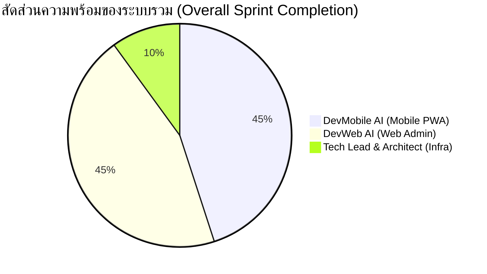

# 📊 Multi-Agent Sprint Progress & Team Status
**Project**: ระบบบันทึกเวลาทำงานและจัดการสาขา ร้านสีแสงยางยนต์ (YOKOHAMA NAYA COSMIS)
**Lead Architect**: Tech Lead (Antigravity)
**Reported to**: 👑 ท่านประธาน (Product Owner & DB Admin)
**Last Updated**: 2026-10-01 13:50 (Bangkok Time)

---

## 🚦 Executive Summary & Sprint Health

| บทบาท (Role) | ผู้รับผิดชอบ | Ticket ปัจจุบัน | สถานะงาน | ความพร้อมของระบบ |
| :--- | :--- | :---: | :---: | :---: |
| 📱 **Mobile & PWA** | `DevMobile AI` | `#MOB-0101` | 🟢 เสร็จสมบูรณ์ (พร้อม UAT) | **100%** |
| 💻 **Web Admin & Dashboard** | `DevWeb AI` | `#WEB-0102` | 🟢 เสร็จสมบูรณ์ (พร้อม UAT) | **100%** |
| 🧠 **Tech Lead & Architect** | `Tech Lead (Antigravity)` | `#ARCH-CORE` | 🟢 คุมมาตรฐาน 0 Regression | **100%** |

---

## 📱 1. รายงานความคืบหน้าฝั่ง `DevMobile AI` (Mobile PWA & Android)

### 🎯 เป้าหมาย: พัฒนาระบบแอปพนักงาน (`src/app/employee/`)
- [x] **Live Authentication**: ล็อกอินผ่าน PIN จริงใน Supabase (`01` / `11`, `02` / `02`, `SI01` / `5101`)
- [x] **Dynamic Geofence 50m**: ตรวจสอบพิกัดร้านสดจาก DB (`15.110481, 104.358552`) ด้วยสูตร Haversine
- [x] **Time Rules & Allowance**: เช็คอินก่อน 08:00 น. ได้เบี้ยขยัน +50฿, หลัง 08:00 น. สาย (0฿ + แจ้งเตือน LINE)
- [x] **HWID Anti-Cheat Device Binding**: ป้องกันการลงเวลาแทนกัน 1 คน 1 เครื่อง (บันทึก `violation_logs` เมื่อใช้อุปกรณ์ซ้ำ)
- [x] **Duplicate Check-in Guard**: ป้องกันการตอกบัตรเข้างานซ้ำซ้อนในวันเดียวกัน
- [x] **Live Stopwatch**: นาฬิกาจับเวลาระยะเวลาทำงานสด (ชั่วโมง:นาที:วินาที)
- [x] **Salary Advance System (`/employee/advance`)**: ยื่นขอเบิกเงินล่วงหน้าและติดตามสถานะ
- [x] **Leave Request System (`/employee/leave`)**: ยื่นใบลา 4 ประเภทพร้อมคำนวณจำนวนวัน
- [x] **Employee Attendance Calendar (`/employee/stats`)**: ปฏิทินแสดงประวัติการลงเวลาและเบี้ยขยันรายเดือน
- [x] **Offline Synchronization Engine**: บันทึกคำขอลง IndexedDB เมื่อไม่มีเน็ตและ Auto-Sync เมื่อต่อสัญญาณ

**📌 สถานะปัจจุบันของ DevMobile**: พัฒนาและทดสอบฟังก์ชันครบถ้วน 100% พร้อมให้พนักงานจริงทดลองใช้งานหน้าร้าน (UAT)

---

## 💻 2. รายงานความคืบหน้าฝั่ง `DevWeb AI` (Web Admin & Dashboard)

### 🎯 เป้าหมาย: พัฒนาระบบควบคุมผู้บริหาร (`src/app/admin/`, `src/app/executive/`)
- [x] **Executive PIN Gate**: ความปลอดภัยล็อกอินผู้บริหาร `SI01` (PIN `5101`)
- [x] **Real-Time Postgres Subscription**: แดชบอร์ดสรุปยอด (`totalPresent`, `totalLate`, `pendingCount`) อัปเดตสด (<100ms)
- [x] **3D WebGL Three.js Visualizer**: กราฟแท่ง 3D และโดนัท 3D พร้อมระบบ 2D Fallback ป้องกันเว็บค้าง
- [x] **Employee Management (CRUD)**: จัดการพนักงาน พร้อมปุ่ม **"ปลดล็อกอุปกรณ์ (Reset HWID)"** เมื่อพนักงานเปลี่ยนเครื่อง
- [x] **Leaflet Store Map Picker**: แผนที่ดาวเทียมกำหนดพิกัดและปรับขนาดรัศมี Geofence (เมตร) แบบอิสระ
- [x] **1-Click Approvals**: ระบบอนุมัติ/ปฏิเสธคำขอเบิกเงินและใบลา พร้อมบันทึกเหตุผลและ Audit Trail
- [x] **Violation & Security Center**: ตรวจจับและบันทึกประวัติการทุจริต (HWID Overlap, นอกพื้นที่, PIN ผิด)
- [x] **Audio Synth Alerts & Notification Drawer**: เสียงเตือนสังเคราะห์และป๊อปอัปแจ้งเตือนสด
- [x] **Export CSV Report**: รายงานประวัติลงเวลาและยอดเงินเบิกล่วงหน้านำไปทำเงินเดือนต่อได้ทันที
- [x] **AI Agent War Room (`/admin/war-room`)**: ศูนย์สั่งการและสนทนากลางเชื่อมต่อ Discord Webhooks

**📌 สถานะปัจจุบันของ DevWeb**: ระบบหลังบ้านพร้อมใช้งาน 100% รอรับข้อมูลการเช็คอินจากพนักงาน

---

## 🧠 3. รายงานความคืบหน้าฝั่ง `Tech Lead & Software Architect`

- **Database Layer**: ซิงค์ตารางจริง `employees`, `store_settings`, `attendance_logs`, `salary_advance_requests`, `leave_requests`, `violation_logs` ใน Supabase
- **Quality Assurance**: Build ผ่าน 100% (0 errors, 17 routes)
- **Multi-Agent Discord Pipeline**: Webhooks 3 ช่องทางพร้อมใช้งาน (`#dev-mobile`, `#dev-web`, `#lead-architect`)
- **Git Sync**: โค้ดทั้งหมดอยู่บน branch `main` ของ GitHub
