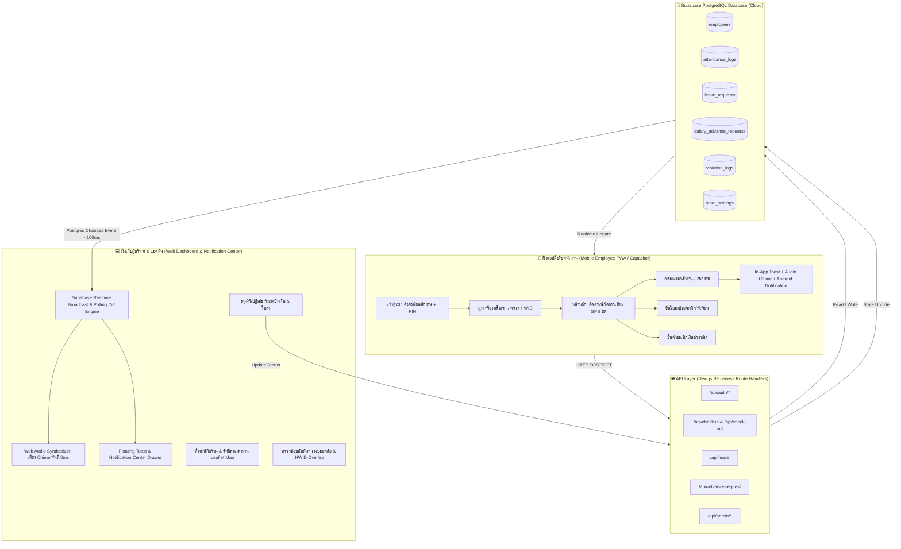
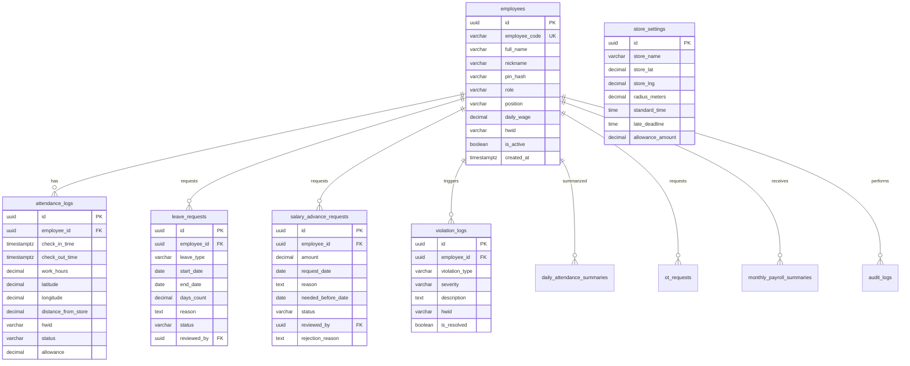

# 📖 สถาปัตยกรรมระบบและคู่มือการพัฒนาฉบับสมบูรณ์ (System Architecture & Master Specification)

> **เอกสารฉบับนี้เป็น Single Source of Truth (SSOT)** สำหรับนักพัฒนาและ AI Assistant ในการทำความเข้าใจโครงสร้าง สถาปัตยกรรม การไหลของข้อมูล (Data Flow), API ทุกเส้นทาง, โครงสร้างฐานข้อมูล Supabase PostgreSQL, และกฎเกณฑ์ความปลอดภัยทั้งหมดของระบบ **Attendance & Salary Advance System (สีแสงยางยนต์ YOKOHAMA NAYA COSMIS)**

---

## 📌 1. ข้อมูลภาพรวมโครงการ (Project Identity & Overview)

* **ชื่อโครงการ**: Attendance Check-In & Salary Advance Management System
* **องค์กร/ร้านค้า**: หจก. สีแสงยางยนต์ (YOKOHAMA NAYA COSMIS สาขาใหญ่)
* **Production Live URL**: `https://check-empolye.vercel.app`
* **Mobile Native App (Android)**: Capacitor Native Shell (Package ID: `com.yokohama.attendance`)
* **Tech Stack**:
  * **Frontend**: Next.js 14 (App Router), TypeScript, Tailwind CSS, Framer Motion, Lucide Icons, Canvas Confetti
  * **Backend & API**: Next.js Serverless Route Handlers (`/app/api/...`), Web Audio API Synthesizer
  * **Database & Realtime**: Supabase PostgreSQL + Supabase Realtime WebSocket Channels
  * **Mobile Bridge**: Capacitor 6 (`@capacitor/core`, `@capacitor/geolocation`, `@capacitor/device`, `@capacitor/local-notifications`)
  * **Map & Geofencing**: Leaflet.js, OpenStreetMap, Haversine Mathematical Geodesic Algorithm

---

## 🧭 2. ผังการไหลของข้อมูลโดยรวม (Overall System Data Flow)



---

## 📱 3. ฝั่งแอปพนักงาน (Mobile Employee Architecture & Flow)

#### 3.1 หน้าจอและเส้นทาง (Routes - Neumorphic 3D Dual-Tone Wave & Dark/Light System)
การออกแบบหน้าจอมือถือพนักงานทั้งหมดได้รับการปรับปรุงเป็นสไตล์ **Soft 3D Neumorphism & S-Curve Wave Dual-Tone**:
* **Theme System**: รองรับการสลับระหว่าง **Dark Mode** (`#090d16` Deep Midnight Indigo พร้อมเงา Neumorphic มืด) และ **Light Mode** (`#eef2f7` Soft Pearl Porcelain พร้อมเงา Embossed แสง-เงาคู่) ผ่าน `useAppTheme()`
* **Top Dome Profile Notch & S-Curve Wave**: ส่วนบนเป็นเลเยอร์คลื่นสีครามเข้มตัดโค้งมนด้วย SVG Wave Cutout พร้อมส่วนครอบ Avatar แบบโดม
* **Tactile 3D Action Tiles Grid**: ตารางปุ่มเมนู 6 ช่องทรง 3 มิติ (เข้างาน, เบิกเงิน, ยื่นใบลา, ปฏิทิน, พิกัดร้าน, เบี้ยขยัน)
* **Piano Key Date Capsules**: แถบแคปซูลแสดงผลประวัติเวลาย้อนหลังสไตล์คีย์เปียโน

1. **`/employee/login` (หน้าล็อกอินพรีเมียม)**:
   - **Real-Time Code Peek**: พิมพ์รหัสพนักงานแล้วตรวจจับและแสดงชื่อเล่นและตำแหน่งทันที
   - **Tactile Neumorphic Keypad**: แป้นตัวเลข 3D Embossed (1-9, C, 0, ⌫) พร้อมสลับโหมดดูรหัสผ่าน
   - ตรวจจับความปลอดภัย HWID เครื่องอัตโนมัติ
2. **`/employee` (หน้าหลักลงเวลาเข้า-ออกงาน)**:
   - **MyShift Progress Card**: การ์ดแสดงผลกะการทำงานพร้อมแถบความคืบหน้า (เหมือนการ์ด MyDocs ในต้นแบบ)
   - **Center Raised 3D Action Button**: ปุ่มวงกลมนูน 3 มิติพร้อมร่องโค้ง Indented Bevel
   - **Live Working Stopwatch**: กล่องจับเวลานับชั่วโมง/นาที/วินาทีการทำงานแบบเรียลไทม์
   - **Realtime Telemetry**: ระยะห่าง GPS ดาวเทียมสด, รัศมี 50 ม., และสถานะซิงค์คลาวด์ (<100ms)
3. **`/employee/stats` (หน้าปฏิทิน & เบี้ยเลี้ยงสะสม)**:
   - **Neumorphic KPI Metric Cards**: เบี้ยเลี้ยงสะสมเดือนนี้ และอัตราตรงเวลา (On-Time %)
   - **Tactile Calendar Grid**: ตารางปฏิทินปุ่ม 3 มิติแยกสีสถานะและยอดเงิน (+50฿, สาย, ลา)
4. **`/employee/leave` (หน้ายื่นใบลา)**:
   - **3D Category Pills**: เลือกประเภทการลา (ลาป่วย 🩺, ลากิจ 💼, ลาพักร้อน 🏖️, อื่นๆ 📝)
   - **Neumorphic Form & Timeline**: ฟอร์มกรอกและประวัติใบลาพร้อม Badge อนุมัติ
5. **`/employee/advance` (หน้าขอเบิกเงินล่วงหน้า)**:
   - **Salary Quota Card**: การ์ดแสดงโควตายอดเงินเดือนคงเหลือ 50%
   - **Quick Amount Chips**: ปุ่มลัดยอดเงินด่วน (500฿, 1,000฿, 2,000฿) แบบ 3D

---

### 3.2 ระบบเมนูนำทางด้านล่างมาตรฐาน (Standard 4-Tab Smart Floating Neumorphic Bottom Nav)
คอมโพเนนต์ [`src/components/EmployeeBottomNav.tsx`](file:///C:/Users/tlelo/.gemini/antigravity/scratch/attendance-pwa/src/components/EmployeeBottomNav.tsx) ถูกติดตั้งในทุกหน้าของพนักงาน โดยมี 4 แท็บมาตรฐาน:

```
┌────────────────────────────────────────────────────────┐
│  ⏱️ เช็คเวลา   │   📅 ปฏิทิน   │ ⚡ (Raised) │  📄 ยื่นใบลา  │  💰 ขอเบิกเงิน │
└────────────────────────────────────────────────────────┘
```

* **Raised Center 3D Action Button**: ปุ่มตรงกลางนูนลอยขึ้นพร้อมร่อง Indented Ring
* **Auto-Hide Behavior**: เลื่อนจอลงหลบเมนูอัตโนมัติ เลื่อนจอย้อนขึ้นแสดงเมนูกลับมาทันที

---

### 3.3 ระบบแจ้งเตือนบนมือถือ (Mobile Notifications & Audio Chimes)
เมื่อการลงเวลาเข้างานหรือออกงานสำเร็จ ระบบมือถือจะทำงานพร้อมกัน 4 ระดับ:
1. **In-App Floating Banner**: การ์ดแจ้งเตือนสีเขียว/น้ำเงิน เลื่อนลงมาจากขอบจอด้านบน แสดงเวลาและข้อความสำเร็จ (อยู่ 6 วินาทีหรือกดปิดได้)
2. **Web Audio Synthesizer**: เล่นเสียง Chime ยืนยันในหูทันที
3. **Android System / Local Notification**: ส่ง Notification เข้าสู่แถบแจ้งเตือนของ Android OS ผ่าน `@capacitor/local-notifications`
4. **Confetti Effect**: ยิงพลุฉลองความสำเร็จบนหน้าจอ

---

## 💻 4. ฝั่งเว็บผู้บริหาร & แอดมิน (Web Dashboard & Notification Center)

### 4.1 หน้าจอหลัก
1. **`/` (Modern Bento Grid Portal Gateway)**:
   - ประตูทางเข้าหลักของระบบ รองรับการเลือกเข้าสู่ระบบระหว่าง **📱 Staff Mobile App** หรือ **💻 Executive Headquarters**
   - แสดงเวลาเรียลไทม์ (Bangkok Asia/Bangkok), สถานะความหน่วงเซิร์ฟเวอร์, และแบรนด์ยางชั้นนำ (YOKOHAMA, NAYA, COSMIS, LENSO)
2. **`/admin` (Web Desktop Headquarters - Modern Bento Grid)**:
   - ออกแบบสไตล์ Linear / Vercel Dark Bento Grid พร้อม Ambient Glow แสงสีฟ้า-มรกต
   - กราฟิกสลับได้ 2 โหมด: **3D WebGL Visualization** (ลูกบอลพลังงาน + อาคารโฮโลแกรม) หรือ **2D Executive Chart**
   - กล่องสรุป KPI: พนักงานทั้งหมด, เข้างานตรงเวลา, มาสาย, ยังไม่ลงเวลา, ยอดเบี้ยขยันวันนี้ (+50฿), เปอร์เซ็นต์ตรงเวลา
   - **ตารางพนักงานสด (Live Staff Table)**: แสดงสถานะเข้างาน, เวลา, ระยะห่างร้าน, สถานะผูกอุปกรณ์ (HWID), ปุ่ม Reset HWID, ปุ่มลบบัญชี
   - **แท็บจัดการใบลา (Leaves Management)**: กดอนุมัติ/ปฏิเสธใบลา
   - **แท็บคำขอเบิกเงิน (Salary Advances)**: กดอนุมัติ/ปฏิเสธ พร้อมระบุเหตุผลหากไม่อนุมัติ
   - **แท็บความปลอดภัย (Security & Violations)**: บันทึกการล็อกอินซ้อนเครื่อง, การพยายามแก้ไขพิกัด GPS, การใช้ PIN ผิด
   - **แท็บตั้งค่าร้าน (Store Geofence Settings)**: ปักหมุดแผนที่ Leaflet GPS, กำหนดรัศมี (50 ม.), เวลาเข้างาน (07:40 / 08:00), ยอดเงินเบี้ยขยัน
   - **ส่งออกข้อมูล CSV (Export CSV)**: ดาวน์โหลดรายงานการลงเวลาในคลิกเดียว
3. **`/executive` (Mobile Executive App - Bento Grid)**:
   - ออกแบบสำหรับผู้บริหารที่เปิดดูผ่านโทรศัพท์มือถือ จัดวางเป็น Bento Cards มินิมอล โทนสี Obsidian Dark ครบถ้วนทุกฟังก์ชันเหมือนเดสก์ท็อป

---

### 4.2 ศูนย์แจ้งเตือนสด (Notification Center & Audio Chimes Engine)
ติดตั้งคอมโพเนนต์ [`src/components/NotificationCenter.tsx`](file:///C:/Users/tlelo/.gemini/antigravity/scratch/attendance-pwa/src/components/NotificationCenter.tsx) และ [`src/lib/web-notifications.ts`](file:///C:/Users/tlelo/.gemini/antigravity/scratch/attendance-pwa/src/lib/web-notifications.ts):

* **เสียงแจ้งเตือนสังเคราะห์ (Web Audio API Synthesizer)** (ไม่พึ่งพาไฟล์เสียงภายนอก โหลดทันที 0ms):
  * 💵 **ขอเบิกเงินล่วงหน้า**: Cash Chime 3 โทน ($F_5 \rightarrow A_5 \rightarrow C_6$)
  * 🟢 **เข้างาน**: Melodic Chime 2 โทน ($E_5 \rightarrow G_5$)
  * 🏁 **ออกงาน**: Soft Completion Chime ($G_5 \rightarrow E_5$)
  * 📄 **ยื่นใบลา**: Gentle Bell ($D_5 \rightarrow F^\#_5$)
  * 🚨 **ความผิดปกติ/โกงพิกัด**: Alert Buzzer ($440\text{Hz}$)
* **การเคลียร์แจ้งเตือนอัตโนมัติเมื่อกดอนุมัติ (Instant Approval Sync)**:
  * เมื่อ Admin กดอนุมัติหรือปฏิเสธคำขอ รายการแจ้งเตือนจะเปลี่ยนเป็น `[✅ อนุมัติแล้ว]` หรือ `[❌ ไม่อนุมัติ]` ทันที
  * ปิด Toast แจ้งเตือนของรายการนั้นทันที
  * ปรับลดตัวเลข Badge สีแดงบนกระดิ่งแบบ Optimistic Update

---

## 🌐 5. รายละเอียด API ทุกเส้นทาง (Complete API Reference)

### 1. `POST /api/auth/check-code` (ตรวจสอบรหัสพนักงาน & ตรวจสอบการผูกเครื่อง)
* **Request**:
  ```json
  { "employeeCode": "01", "hwid": "device-uuid-hash-12345" }
  ```
* **Logic**:
  1. ค้นหาพนักงานจาก `employee_code` ในตาราง `employees`
  2. หากบัญชีเป็น `ADMIN` (เช่น SI01) อนุญาตให้ล็อกอินได้ทุกอุปกรณ์
  3. หากเป็น `STAFF`:
     * ถ้ายังไม่เคยผูกเครื่อง (`hwid == null`) $\rightarrow$ ตอบรับพร้อมให้ผูกเครื่อง
     * ถ้าผูกเครื่องแล้วแต่ `hwid !== employee.hwid` $\rightarrow$ บันทึก `violation_logs` ประเภท `DEVICE_MISMATCH` และส่งคำเตือน
     * ตรวจสอบว่าเครื่องนี้ (`hwid`) เคยผูกกับพนักงานคนอื่นหรือไม่ ถ้ามี $\rightarrow$ บันทึก `HWID_OVERLAP` (แจ้งเตือนผู้บริหารเรื่องการลงเวลาแทนกัน)
* **Response (200 OK)**:
  ```json
  {
    "success": true,
    "exists": true,
    "employee": {
      "id": "uuid",
      "employeeCode": "01",
      "fullName": "สมชาย ยางยนต์",
      "nickname": "เติ้ล",
      "role": "STAFF",
      "isHwidBound": true
    }
  }
  ```

---

### 2. `POST /api/auth/verify-pin` (ยืนยัน PIN 4 หลัก)
* **Request**:
  ```json
  { "employeeCode": "01", "pin": "1234", "hwid": "device-uuid-hash-12345" }
  ```
* **Logic**:
  1. เปรียบเทียบ PIN กับ `pin_hash` ในฐานข้อมูล
  2. หากพนักงานยังไม่เคยผูกเครื่อง จะอัปเดต `hwid` ประจำตัวลงตาราง `employees`
* **Response (200 OK)**:
  ```json
  {
    "success": true,
    "message": "เข้าสู่ระบบสำเร็จ",
    "employee": {
      "id": "uuid",
      "employeeCode": "01",
      "fullName": "สมชาย ยางยนต์",
      "nickname": "เติ้ล",
      "role": "STAFF",
      "dailyWage": 400
    }
  }
  ```

---

### 3. `POST /api/check-in` (ลงเวลาเข้างานพร้อมพิกัด GPS)
* **Request**:
  ```json
  {
    "employeeId": "uuid",
    "latitude": 15.110420,
    "longitude": 104.358440,
    "accuracy": 4.5,
    "hwid": "device-uuid-hash-12345"
  }
  ```
* **Logic**:
  1. **Device Binding Check**: ตรวจสอบว่า `hwid` ตรงกับเครื่องที่ผูกไว้หรือไม่
  2. **Duplicate Check-in Protection**: ตรวจสอบว่าวันนี้เคยลงเวลาเข้างานไปแล้วหรือไม่
  3. **Geofence Calculation**: คำนวณระยะห่างจากพิกัดร้าน (`store_lat`, `store_lng`) ด้วย Haversine Formula
     * หากระยะห่าง $>$ `radius_meters` (50 ม.) $\rightarrow$ บันทึก `violation_logs` ประเภท `OUT_OF_GEOFENCE_BLOCKED` และปฏิเสธการลงเวลา (403 Forbidden)
  4. **Punctuality & Allowance Calculation**:
     * เวลาเข้างาน $\le$ `standard_time` (07:40:00) หรือ `late_deadline` (08:00:00) $\rightarrow$ `status = 'PRESENT'`, `allowance = 50.00`
     * เวลาเข้างาน $>$ `late_deadline` (08:00:00) $\rightarrow$ `status = 'LATE'`, `allowance = 0.00`
  5. **Database Insert**: บันทึกลงตาราง `attendance_logs` $\rightarrow$ กระจายข้อมูล Realtime
* **Response (200 OK)**:
  ```json
  {
    "success": true,
    "data": {
      "id": "uuid",
      "status": "PRESENT",
      "checkInTime": "07:45:12",
      "allowance": 50,
      "distanceMeters": 5.2,
      "message": "ลงเวลาเข้างานตรงเวลา (+50฿ เบี้ยขยัน)"
    }
  }
  ```

---

### 4. `POST /api/check-out` (ลงชื่อออกงาน)
* **Request**:
  ```json
  {
    "employeeId": "uuid",
    "latitude": 15.110420,
    "longitude": 104.358440,
    "accuracy": 4.5,
    "hwid": "device-uuid-hash-12345"
  }
  ```
* **Logic**:
  1. ค้นหา Log การเข้างานของวันนี้
  2. ตรวจสอบพิกัด GPS ว่าอยู่ในรัศมีร้านหรือไม่
  3. คำนวณชั่วโมงการทำงาน (`work_hours = (check_out_time - check_in_time) / 3600`)
  4. อัปเดต `check_out_time` และ `work_hours` ในตาราง `attendance_logs`
* **Response (200 OK)**:
  ```json
  {
    "success": true,
    "data": {
      "id": "uuid",
      "checkOutTime": "18:00:25",
      "workHours": 9.25,
      "workingDuration": "9 ชั่วโมง 15 นาที"
    }
  }
  ```

---

### 5. `GET /api/admin/analytics` (ศูนย์รวมข้อมูลแดชบอร์ดผู้บริหาร)
* **Query Params**: `?period=daily` หรือ `monthly`
* **Response Data Structure**:
  * `overview`: สรุปยอดคนตรงเวลา, มาสาย, ยังไม่ลงเวลา, ยอดเบี้ยขยันสะสม
  * `attendanceLogs`: ประวัติการลงเวลาเข้า-ออกงานทั้งหมดของวันนี้
  * `employees`: ข้อมูลพนักงานทุกคนและสถานะ HWID
  * `salaryAdvanceRequests`: รายการคำขอเบิกเงินล่วงหน้า
  * `leaveRequests`: รายการคำขอยื่นใบลา
  * `violationLogs`: รายการตรวจพบความผิดปกติและประวัติการล็อกอินซ้อน
  * `settings`: การตั้งค่านโยบายและพิกัดร้าน

---

### 6. `GET, POST, PUT /api/advance-request` (ระบบขอเบิกเงินล่วงหน้า)
* **`POST` (พนักงานส่งคำขอเบิกเงิน)**:
  ```json
  {
    "employeeId": "uuid",
    "amount": 1000,
    "requestDate": "2026-09-27",
    "reason": "ค่าซ่อมรถจักรยานยนต์",
    "neededBeforeDate": "2026-09-30"
  }
  ```
* **`PUT` (ผู้บริหารอนุมัติหรือปฏิเสธคำขอ)**:
  ```json
  {
    "requestId": "uuid",
    "status": "APPROVED", // หรือ "REJECTED"
    "reviewerId": "uuid-executive",
    "rejectionReason": "เกินโควตาเงินเดือนสะสม"
  }
  ```

---

### 7. `GET, POST, PUT /api/leave` (ระบบยื่นและอนุมัติใบลา)
* **`POST` (พนักงานยื่นใบลา)**:
  ```json
  {
    "employeeId": "uuid",
    "leaveType": "SICK",
    "startDate": "2026-09-28",
    "endDate": "2026-09-29",
    "reason": "มีไข้สูง ไปพบแพทย์"
  }
  ```
* **`PUT` (ผู้บริหารพิจารณาใบลา)**:
  ```json
  {
    "leaveId": "uuid",
    "status": "APPROVED",
    "approverId": "uuid-executive"
  }
  ```

---

### 8. `POST, PUT, DELETE /api/admin/employee` (จัดการบัญชีพนักงาน & ปลดล็อกเครื่อง)
* **`POST` (เพิ่มพนักงานใหม่)**: รหัสพนักงาน, ชื่อ-นามสกุล, ชื่อเล่น, PIN 4 หลัก, ตำแหน่ง
* **`PUT` (Reset HWID ปลดล็อกเครื่อง)**: ส่ง `{ "id": "uuid", "clearHWID": true }` เพื่อให้พนักงานสามารถผูกเครื่องใหม่ได้
* **`DELETE` (ลบบัญชีพนักงาน)**: ลบข้อมูลพนักงาน (ไม่อนุญาตให้ลบบัญชีผู้บริหารสูงสุด SI01)

---

### 9. `POST /api/admin/settings` (ตั้งค่าพิกัดร้าน & Geofence)
* **Request**:
  ```json
  {
    "store_name": "สีแสงยางยนต์ YOKOHAMA NAYA COSMIS",
    "store_lat": 15.110412,
    "store_lng": 104.358434,
    "radius_meters": 50,
    "standard_time": "07:40:00",
    "late_deadline": "08:00:00",
    "closing_time": "17:30:00",
    "allowance_amount": 50
  }
  ```

---

## 🐘 6. สถาปัตยกรรมฐานข้อมูล Supabase PostgreSQL (11 ตาราง)



### รายการ 11 ตารางในระบบ:
1. **`employees`**: บัญชีพนักงานและผู้บริหาร, รหัสผ่าน PIN, บทบาท (`STAFF`, `ADMIN`), และรหัสเครื่องประจำตัว (`hwid`)
2. **`store_settings`**: พิกัดร้านค้า GPS, รัศมีลงเวลา (เมตร), เวลาเข้างานตรงเวลา, เวลาตัดสาย, ยอดเบี้ยขยัน
3. **`attendance_logs`**: บันทึกการลงเวลาเข้างานและออกงานแต่ละครั้ง (พิกัด GPS, ระยะห่างร้าน, สถานะ, เบี้ยขยัน, ชั่วโมงทำงาน)
4. **`daily_attendance_summaries`**: สรุปสถิติการมาทำงานรายวันของพนักงานแต่ละคน
5. **`leave_requests`**: คำขอยื่นใบลา (ป่วย, กิจ, พักร้อน) และผลการพิจารณาของผู้บริหาร
6. **`salary_advance_requests`**: คำขอเบิกเงินล่วงหน้า, ยอดเงิน, เหตุผล, วันที่ต้องการเงิน, สถานะการอนุมัติ
7. **`violation_logs`**: บันทึกความปลอดภัย (ล็อกอินซ้อนเครื่อง `HWID_OVERLAP`, พยายามลงเวลานอกพื้นที่ `OUT_OF_GEOFENCE_BLOCKED`)
8. **`ot_requests`**: คำขอทำงานล่วงเวลา (OT) และจำนวนชั่วโมง
9. **`monthly_payroll_summaries`**: สรุปยอดเงินเดือน, เบี้ยขยันสะสม, OT, และยอดจ่ายสุทธิประจำเดือน
10. **`announcements`**: ข่าวสารและประกาศสำคัญของร้าน
11. **`audit_logs`**: บันทึกประวัติการกระทำของผู้บริหาร (การ Reset HWID, การแก้ไขการตั้งค่าร้าน)

---

## 🛡️ 7. กฎเกณฑ์ความปลอดภัยและ Business Logic ที่ AI ควรรู้

1. **ระบบป้องกันการตอกบัตรแทนกัน (Anti-Buddy Punching with Hardware Fingerprint)**:
   - อุปกรณ์โทรศัพท์แต่ละเครื่องจะมี HWID เฉพาะตัว (สร้างจาก WebGL, Audio Context, Canvas Fingerprint, Platform UUID)
   - พนักงาน 1 คนผูกได้เพียง 1 เครื่องเท่านั้น
   - หากพนักงาน $A$ พยายามล็อกอินบนเครื่องของพนักงาน $B$ ระบบจะตรวจจับและบันทึกเป็น `HWID_OVERLAP` พร้อมแจ้งเตือนผู้บริหารทันที
2. **ระบบป้องกันการโกงพิกัด GPS (Anti-Fake GPS & Geofencing)**:
   - ใช้สูตร **Haversine Geodesic Distance Formula** คำนวณความโค้งของโลกตามจริง:
     $$d = 2R \arcsin\left(\sqrt{\sin^2\left(\frac{\Delta\phi}{2}\right) + \cos(\phi_1)\cos(\phi_2)\sin^2\left(\frac{\Delta\lambda}{2}\right)}\right)$$
   - รัศมีมาตรฐานคือ $50$ เมตรจากจุดศูนย์กลางร้าน
   - หากอยู่นอกรัศมี ปุ่มลงเวลาจะถูกล็อก และหากพยายามยิง API จะถูกบล็อกด้วยรหัส 403 ทันที
3. **นโยบายเวลาเข้างานและเบี้ยขยัน (Punctuality & Allowance Policy)**:
   - เวลาเข้างานมาตรฐาน: $\le 07:40$ น. (อนุโลมถึง $08:00$ น.) $\rightarrow$ ได้รับเบี้ยขยัน $+50$ บาท/วัน
   - เวลาเข้างาน $> 08:00$ น. $\rightarrow$ สถานะ "มาสาย" ได้รับเบี้ยขยัน $0$ บาท
4. **ความถูกต้องของเวลาฝั่งเซิร์ฟเวอร์ (Strict Server Clock)**:
   - ยึดเวลามาตรฐานประเทศไทย (`Asia/Bangkok`) จาก Server เสมอ ป้องกันพนักงานปรับเวลาในโทรศัพท์

---

## 🚀 8. การ Build & Deploy (DevOps Guide)

* **การทดสอบ Build**:
  ```powershell
  npm run build
  ```
* **การส่งโค้ดขึ้น Production (Vercel Auto-Deploy)**:
  ```powershell
  git add src/ supabase/ SYSTEM_ARCHITECTURE.md
  git commit -m "feat: master system architecture and data flow documentation"
  git push origin main
  ```
* **การทดสอบบนอุปกรณ์ Android จริงผ่าน ADB**:
  ```powershell
  & "C:\Users\tlelo\.gemini\antigravity\tools\android-sdk\platform-tools\adb.exe" devices
  & "C:\Users\tlelo\.gemini\antigravity\tools\android-sdk\platform-tools\adb.exe" -s f4da450d shell monkey -p com.yokohama.attendance -c android.intent.category.LAUNCHER 1
  ```
