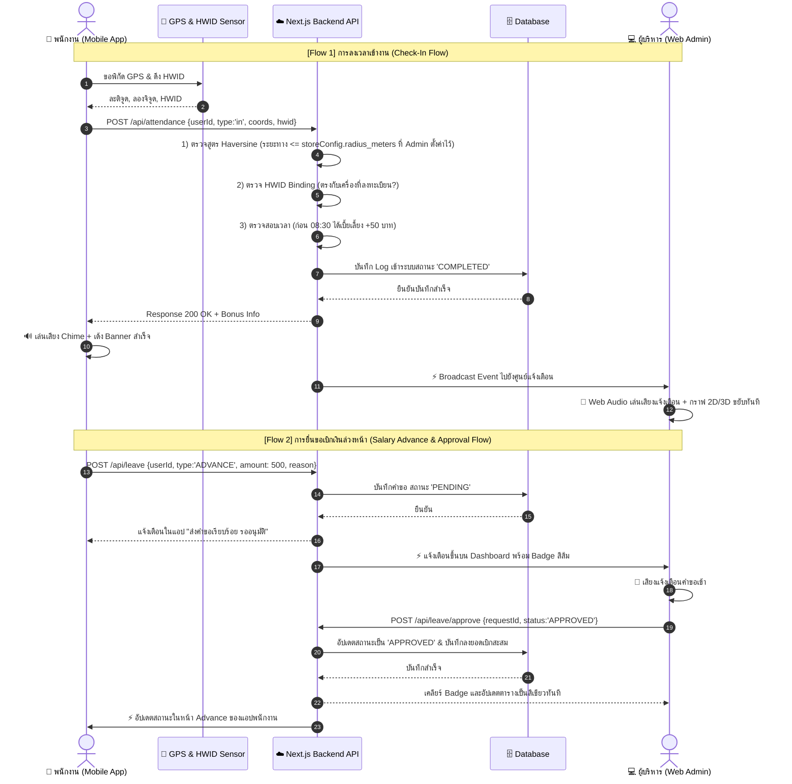

# 📊 คู่มือนำเสนอภาพรวมระบบ (Executive Infographic & System Manual)
### ระบบบันทึกเวลาทำงานและบริหารจัดการสาขาอัจฉริยะ (Smart Attendance & Branch Management System)
**ร้าน สีแสงยางยนต์ (YOKOHAMA NAYA COSMIS)**

---

## 📱 1. ฝั่งแอปพนักงานมือถือ (Mobile Employee App)

### 🌟 5 ระบบหลักในแอปพลิเคชันพนักงาน:

1. **📍 Hardware GPS Geofencing (Dynamic Radius ปรับเปลี่ยนได้ตามที่ Admin ตั้งค่า):**
   - คำนวณพิกัดดาวเทียมแบบ Real-time ด้วยสูตร Haversine
   - **รัศมีปรับเปลี่ยนได้อิสระตามความต้องการของ Admin**: ระบบดึงค่ารัศมีจาก Store Settings แบบ Real-time หากอยู่นอกระยะที่ Admin กำหนด ปุ่มลงเวลาจะถูกล็อกอัตโนมัติ ป้องกันการโกงลงเวลาจากที่บ้าน
2. **⏱️ One-Tap Smart Check-In / Check-Out (ลงเวลาง่ายใน 1 วินาที):**
   - หน้าจอ Live Digital Clock & Stopwatch บ่งบอกชั่วโมงการทำงานแบบวินาทีต่อวินาที
   - อัปเดตสถานะแบบ Real-time (ทำงานอยู่ / ออกงานแล้ว / เบิกเงินสะสม)
3. **🧭 4-Tab Smart Auto-Hide Bottom Navigation Bar:**
   - เมนู 4 แถบมาตรฐาน: **แดชบอร์ด (Home) | ประวัติ (History) | เบิกเงิน/ลา (Advance) | ข้อมูลส่วนตัว (Profile)**
   - ระบบ **Auto-Hide on Scroll**: ซ่อนแถบเมนูอย่างนุ่มนวลเมื่อเลื่อนดูรายการยาวๆ เพื่อเพิ่มพื้นที่การอ่าน และแสดงกลับทันทีเมื่อเลื่อนขึ้น
4. **🔔 In-App Notification Banner & Audio Chimes (การแจ้งเตือนพร้อมเสียงสังเคราะห์):**
   - แถบแจ้งเตือนลอยด้านบนสีเขียว/ฟ้าแจ้งผลการลงเวลาสำเร็จทันที
   - คำนวณเบี้ยเลี้ยงพิเศษ (+50 บาท) อัตโนมัติเมื่อเข้างานก่อน 08:30 น.
   - แจ้งผลการอนุมัติใบลา/เงินเบิกล่วงหน้าทันทีที่ผู้บริหารกดยืนยัน
5. **🛡️ HWID Device Binding (Anti-Buddy Punching):**
   - ผูกเครื่องโทรศัพท์กับรหัสพนักงาน ป้องกันการฝากเพื่อนตอกบัตรหรือสลับเครื่องโดยไม่ได้รับอนุญาต

---

## 💻 2. ฝั่งเว็บผู้บริหาร & แอดมิน (Web Admin & Executive Dashboard)

### 🌟 5 ระบบหลักในแดชบอร์ดผู้บริหาร:

1. **🌐 3D WebGL Holographic Energy Core & 2D Live Attendance Analytics:**
   - แอนิเมชันลูกโลก 3D Three.js แสดงพลังงานและสถานะสาขาแบบ Sci-Fi
   - กราฟสถิติ 2D วิเคราะห์อัตราการเข้างานตรงเวลา (On-time), มาสาย (Late), ทำงานล่วงเวลา (Overtime) รายวัน/รายเดือน
2. **🔔 Real-Time Live Notification Center (Web Audio Synthesizer):**
   - ศูนย์รวมการแจ้งเตือน Real-time เมื่อมีพนักงาน Check-in/out หรือยื่นขอเบิกเงิน/ลา
   - เสียงสังเคราะห์ Chime แจ้งเตือนคมชัดระดับ 0ms Latency โดยไม่ต้องโหลดไฟล์เสียงภายนอก
3. **⚡ Instant One-Click Approval & Rejection Engine:**
   - ระบบอนุมัติคำขอเบิกเงินล่วงหน้าและใบลาเพียงคลิกเดียว (ปุ่มเขียว Approve / ปุ่มแดง Reject)
   - หักล้างและเคลียร์ Badge แจ้งเตือนอัตโนมัติแบบทันที ไม่ต้องรีเฟรชหน้าจอ
4. **🗺️ Interactive Leaflet GPS Store Geofence Picker:**
   - แผนที่ดาวเทียมพร้อมหมุดพิกัดร้านและวงรัศมี Geofence
   - ผู้บริหารสามารถคลิกเปลี่ยนพิกัดร้านและปรับขยาย/ย่อรัศมีตรวจจับได้ทันทีจากหน้าจอ โดยฝั่งพนักงานจะอัปเดตระยะตามที่ตั้งค่าไว้ทันที
5. **🔒 Security & Fraud Prevention Center (ระบบตรวจจับการโกง):**
   - ตรวจจับความผิดปกติของ Hardware ID (HWID Overlap Detection)
   - บันทึก IP Address และแจ้งเตือนเมื่อพบพฤติกรรมน่าสงสัยหรือการพยายามจำลอง GPS (Mock Location)

---

## 🔄 3. ภาพรวมการไหลของข้อมูลทั้งระบบ (End-to-End Data Flow Architecture)

### 🌊 การไหลของข้อมูลแบบละเอียด (Sequence Flow):

---

### 🔍 สรุปการไหลของข้อมูล 3 วงจรหลัก:

#### 1. ⏱️ วงจรการลงเวลาเข้างาน (Check-In & Allowance Loop):
1. **ต้นทาง (Mobile PWA)**: พนักงานแตะปุ่มลงเวลา -> อ่านค่าพิกัด GPS ละติจูด/ลองจิจูด และค่า Hardware ID (HWID).
2. **ประมวลผล (API Engine)**:
   - ตรวจสอบระยะทางจริงด้วย **Haversine Formula**: ต้อง $\le$ รัศมีที่ Admin กำหนดไว้ใน Store Settings (เช่น 30m, 50m, 100m)
   - ตรวจสอบความถูกต้องของ **HWID Binding**: ป้องกันการลงเวลาแทนกัน
   - คำนวณเบี้ยเลี้ยงพิเศษ **Early Bird Allowance (+50 THB)** หากลงเวลาก่อน 08:30 น.
3. **จัดเก็บ (Database)**: บันทึกประวัติการเข้างาน, พิกัด, และเวลาที่แน่นอน
4. **ปลายทาง (Real-time Broadcast)**:
   - **ฝั่งมือถือ**: ส่งเสียง Chime สังเคราะห์และแสดง Banner ยืนยันการเข้างานสำเร็จ
   - **ฝั่งเว็บแอดมิน**: ศูนย์แจ้งเตือนส่งเสียง Chime แจ้งเตือนผู้บริหาร และกราฟสถิติ 2D/3D อัปเดตทันที

#### 2. 💸 วงจรการเบิกเงินล่วงหน้า & อนุมัติ (Advance & 1-Click Approval Loop):
1. **ยื่นคำขอ (Mobile)**: พนักงานระบุยอดเงินและเหตุผล -> ส่งคำขอ `POST /api/leave`
2. **แจ้งเตือนสด (Web Admin)**: ปรากฏการแจ้งเตือนสดพร้อม Badge สีส้ม และเสียงสังเคราะห์ Chime
3. **อนุมัติทันที (1-Click Action)**: ผู้บริหารคลิก **Approve** หรือ **Reject**
4. **ปิดยอดและเคลียร์แจ้งเตือน (State Sync)**:
   - ระบบเคลียร์ Badge ออกจากแถบแจ้งเตือนของแอดมินอัตโนมัติ
   - ยอดเงินสะสมและสถานะในแอปมือถือของพนักงานอัปเดตเป็น "อนุมัติแล้ว" ทันที

#### 3. 🛡️ วงจรตรวจจับและป้องกันการโกง (Security & Anti-Fraud Loop):
1. ตรวจจับและบล็อกการจำลองตำแหน่ง GPS (Mock Location Detection)
2. ตรวจสอบเครื่องที่ใช้ตอกบัตรซ้ำหลายบัญชี (HWID Overlap Detection)
3. ส่งข้อมูล IP และพิกัดที่น่าสงสัยขึ้นรายงานความปลอดภัย (Security Log) บนหน้าเว็บผู้บริหารแบบเรียลไทม์
